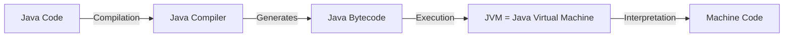
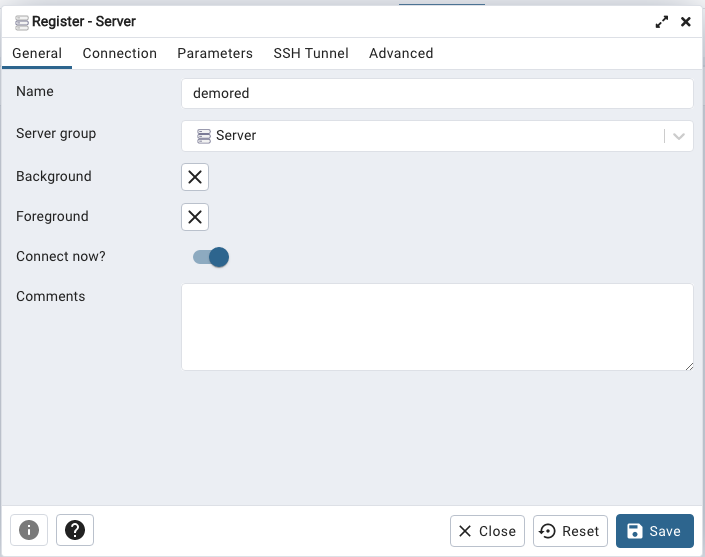
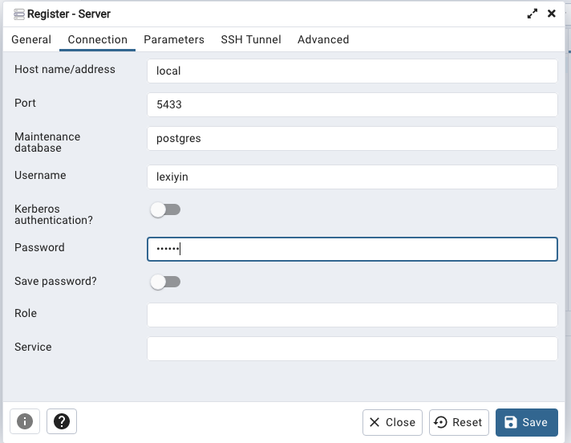
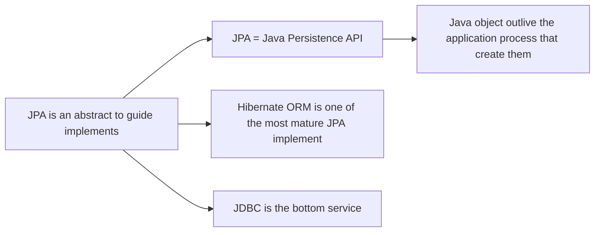

# Data Mapping
-----

# How Java Works?



# Build PostgreSQL Container

1. Open Docker Desktop
2. Create/Open a Docker Container

```zsh
$ docker run --name ${PostgresContainerName} -e POSTGRES_USER=${username} -e POSTGRES_PASSWORD=${password} -e POSTGRES_DB=${databaseName} -p ${hostport}:${containerport} -d postgres
```

My Command

```zsh
(base) essieyin@Essies-MBP ~ % docker run --name vlogapp5433 -e POSTGRES_USER=lexiyin -e POSTGRES_PASSWORD=pwd123 -e POSTGRES_DB=vlogappDB -p 5433:5432 -d postgres

99eb38c3b37b6b83300092ead13459bc6c0a6aaf30f7f4eed5df268b30b9d2fe
```

3. migrate my data

```zsh
$ mvn flyway:clean
```

```zsh
$ mvn flyway:migrate
```

Server (rightclick) --> register --> server

<div style="display: flex;">
    
    
</div>

pgAdmin 是一个 Client，要连上 DB Server 才能工作。flyway 的好处是方便 migrate，我们的表可以经常变化。

```xml
<plugin>
	<groupId>org.flywaydb</groupId>
    <artifactId>flyway-maven-plugin</artifactId>
	<version>9.16.0</version>
	<configuration>
		<driver>org.postgresql.Driver</driver>
		<url>jdbc:postgresql://localhost:5433/vlogappDB</url>
		<user>lexiyin</user>
		<password>pwd123</password>
		<schemas>
			<schema>public</schema>
		</schemas>
		<cleanDisabled>false</cleanDisabled>
	</configuration>
</plugin>
```

**(Interview) Persistent Layer 是拿来干啥的？**

- 和数据库交互， records 和 memory 之间的互相转化。
- (ENG) The Persistent layer is used to facilitate interaction between a program and a database. **It acts as a bridge between the application's data records and the memory of the computer.** Its primary purpose is to handle the conversation and communication between these two entities.

**(Interview) Why do we need Maven?**

- Manage Dependencies. （POM.xml）
- Maven is a business tool to manage the project life cycle
  - maven 可以拿来管理 dependency, 做 develop, test, 打包。

**(Interview) Why do we need flyway?**

- Flyway is a **migration tool which allows us to provide version control for database schemas**. It provides a **seamless and automated** way to **manage database schema changes** over time.

**(Interview)Java 和 Database 建立连接需要五大要素：**
(1) username
(2) password
(3) **数据库地址 (Domain URL)**
(4) 数据库名字 (Database Name)
(5) 端口 port (Port)

---

# Persistent Layer


- Model 是告诉我们这个 function 和 database 是怎么样的，Controller 就是来控制我们这个 function 和 user interface 的交互，View 就是用户看的东西 = 如何显示数据。
- Model = 我们怎么和数据交互的模版

## DAO


- Data Access Object Pattern or DAO pattern is used to **separate** low level data accessing API or operation from high level business services.
- DAO layer is **responsible for Data access** from the persistence storage [DB/LDAP/File system] and manipulation of Data in the persistence storage.
- **Decouple** the persistence storage implementation from the rest of your applciation.

## Hibernate


==> 所以我们会发现，我们每次都需要同样的参数（重复的代码）去建立一个链接 ==> 那我们为啥不建立一个工厂呢！==> 也是 Java 里面的一个 design pattern。
（面试可能会要求你手写 Factory Design Pattern 100% 要会，Singleton Design Pattern, Builder Design Pattern）

### Configuration

Configuration is used to build Hibernate sessionFactory, including:

- Database Connection
- Class Mapping -- creates the connection between the Java classes and databases tables. (@Entity 那些)
- Hibernate configuration file `hibernate.cfg.xml`



# DataMapping

## Table -- Java Class Mapping

```java
@Entity
@Table(name = "users")
public class User {
	// ... Column Mappings
}
```

## Column Mapping

```java
public class User {

    @Id
    @GeneratedValue(strategy = GenerationType.IDENTITY)
    private Long id;

    @Column(name = "user_name")
    private String userName;

    @Column(name = "user_password")
    private String userPassword;

	// We dont have to map FK (foreign key) at this stage
}
```

## Map Reference

### One To Many -- One Side

```java
@Entity
@Table(name = "users")
public class User{
	// ...
	@OneToMany(mappedBy = "user", cascade = CascadeType.PERSIST, fetch = FetchType.LAZY)   // 特别要注意！！！！这里mappedBy="...", 这里面的东西应该是Post Class里User的object名字
	private Set<Post> posts;
}
```

### One To Many -- Many Side

```java
@ManyToOne(fetch = FetchType.LAZY)
@JoinColumn(name = "users_id")
private User user;
```

### Many To Many -- Owning Side Mapping

```java
@ManyToMany(cascade = CascadeType.ALL, fetch = FetchType.LAZY)
@JoinTable(name = "post_hashtag",
        joinColumns = {@JoinColumn(name = "post_id")},
        inverseJoinColumns = {@JoinColumn(name = "hashtag_id")})
private Set<Hashtag> hashtags;
```

### Many To Many -- Target Side Mapping

```java
@ManyToMany(mappedBy = "hashtags", fetch = FetchType.LAZY)
private Set<Post> posts;
```

---

# Spring Data JPA

Directory: `com.myrestfulapp.repository`

```java
import org.springframework.data.jpa.repository.JpaRepository;

public interface UserRepository extends JpaRepository<User, Long> {
}

public interface RoleRepository extends JpaRepository<Role, Long> {
}

public interface PostRepository extends JpaRepository<Post, Long> {
}

public interface HashtagRepository extends JpaRepository<Hashtag, Long> {
}
```

#
